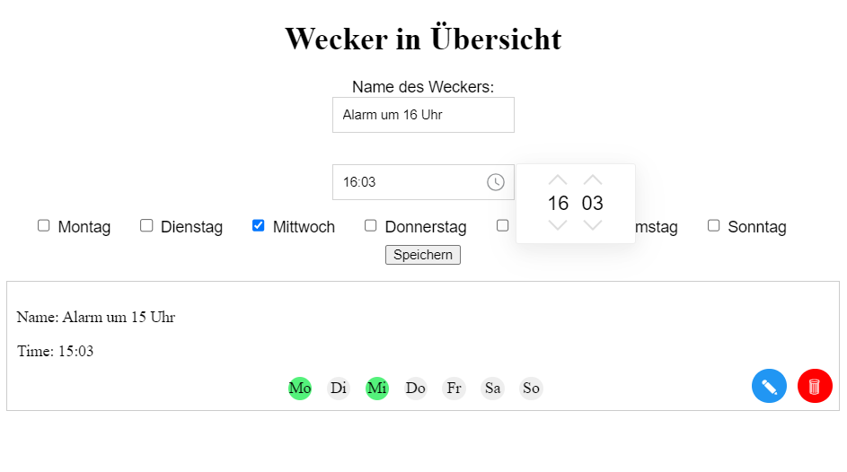

# Under heavy development
A simple Web-alarm that plays the alarm on the server

to test install https://bun.sh and go to localhost:3000

#Todo

#high prio
use wakeup names with hash values of the names

#mid prio
change audio files from Web via selection
edit existing alarms
try out https://tailwindcss.com/

#low prio

#made
delete alarm clock
get baking to work (audio)
